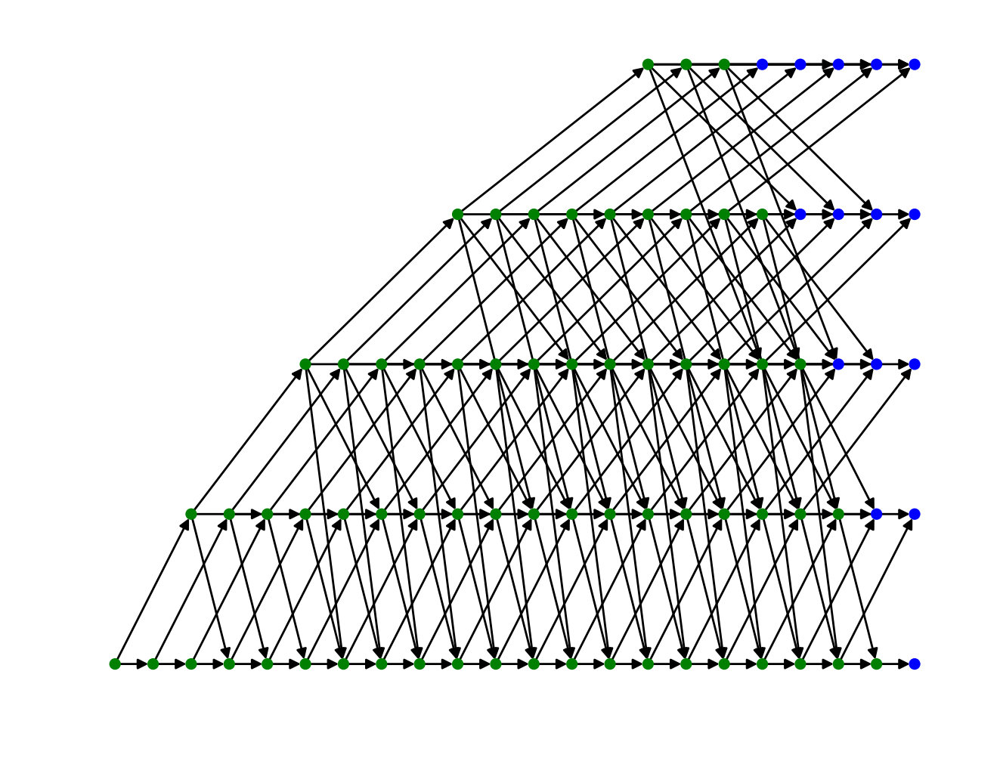
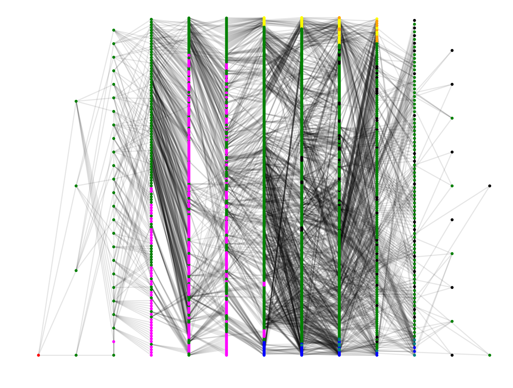

# Code quality

 See [details here](https://circleci.com/gh/idsc-frazzoli/driving-games).

<!-- Note: there is a "branch" in the url -->

 (for master) - See [details](https://codecov.io/gh/idsc-frazzoli/driving-games).

(You need to be logged in with Github account in both cases.)

# Driving Games

Reachable states for player 1:

Jointly reachable states for two players.
Red is the initial state.
Magenta are collision states. Green are states where two players are active.
Yellow and blue are states in which there is only one agent.
Black are terminating states for the single-player game.

# Installation

Git clone this repository and init the submodules via `$ git submodule update --init ` (which downloads a set of commonroad senarios).

There are two options to install this package: via Docker or performing a native installation

### Docker installation and run
To build the docker image

    $ make build

this operation will build a docker image based on the instructions contained in the `Dockerfile`.
As you may notice this will build on top of a pre-existing [image](https://hub.docker.com/repository/docker/alezana/dg_base) which contains some extra dependencies
(e.g. [CommonRoad](https://commonroad.in.tum.de/)).
To run an example:

    $ make run

The results are going to be written in the `out-docker` dir.

### Native installation

Requires Python >= 3.8.

Run manually the instructions in both the Dockerfiles: first replicate `docker/Dockerfile.base` on your host machine; then `Dockerfile`.
The instructions in `Dockerfile.base` install CommonRoad packages and relative dependencies, further [instructions](https://commonroad.in.tum.de/docs/commonroad-drivability-checker/sphinx/) are available at their webpage
The `Dockerfile` install all the reqs in `requirements.txt` and the `driving-games`package.

Run tests using:

    $ make clean test coverage-combine coverage-report

Make the docs using:

    $ make docs

Run some games using:

    $ dg-demo --reset

Reformat with `black` using:

	$ make black
